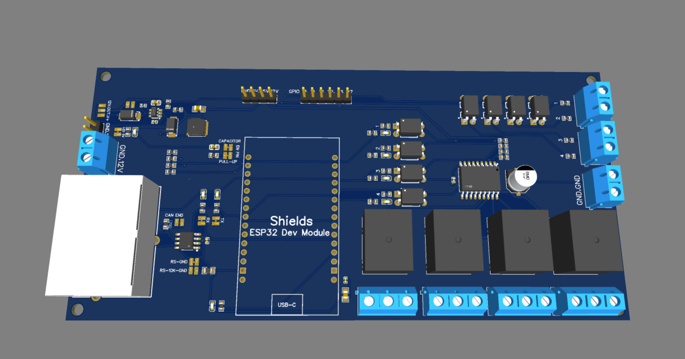
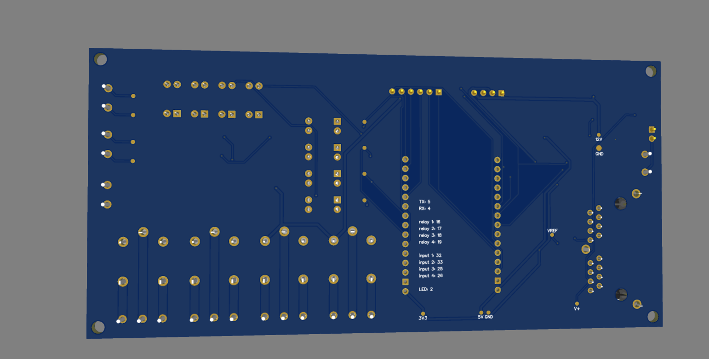
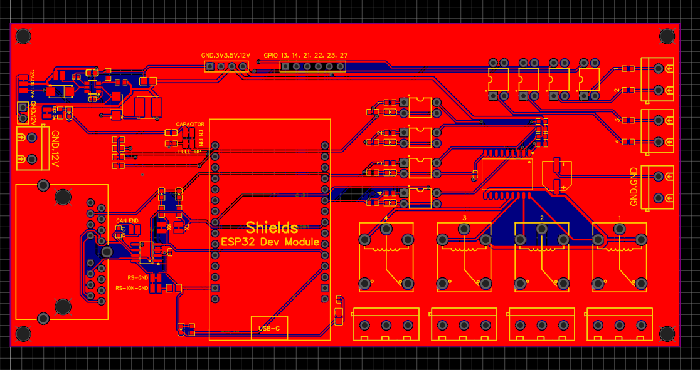
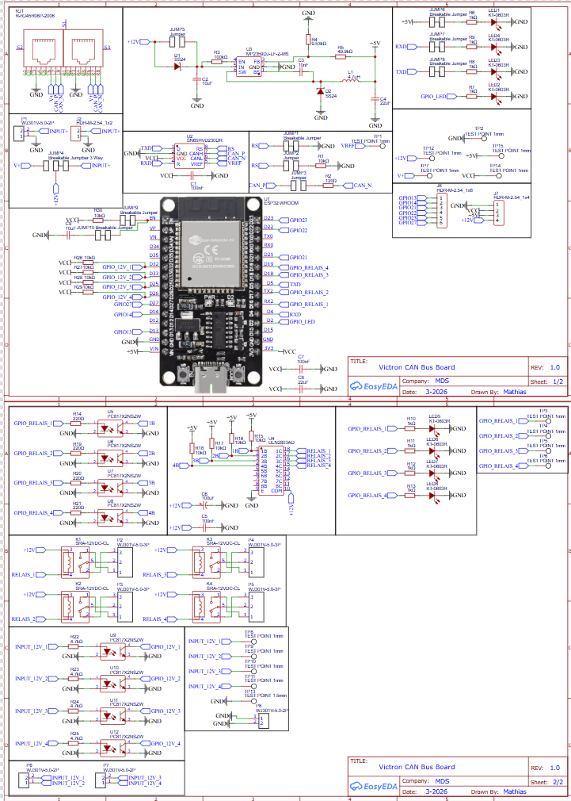

# ESP32-CAN-Relay-Control-Board

## Project Description

The ESP32 CAN Relay Controller is a custom hardware project designed to provide relay outputs and isolated input monitoring over a CAN bus network. The board is based on an ESP32 microcontroller and communicates using a CAN transceiver connected to an RJ45 interface compatible with Victron Cerbo systems.

The board includes four 12V relay outputs and four opto-isolated 12V inputs. Relays are driven using a ULN2803 Darlington array and optocouplers to provide electrical isolation and protect the ESP32 from high voltage signals. CAN communication is handled by the SN65HVD230 transceiver, allowing the board to integrate with CAN bus based systems.

This project was designed as a compact and reliable control interface that can monitor external signals and control loads through relays while communicating with a CAN network.

---

## How to Use the Project

To use the board, connect it to a CAN network using the RJ45 connector. The ESP32 communicates with the CAN bus through the SN65HVD230 transceiver. The firmware running on the ESP32 reads the opto-isolated input signals and controls the relay outputs accordingly.

External devices can be connected to the relay outputs to switch loads such as lights, pumps, or other equipment. The opto-isolated inputs allow safe monitoring of external 12V signals without directly exposing the ESP32 to higher voltages.

The board is powered using a stable power supply, with onboard voltage regulation and decoupling capacitors ensuring stable operation.

!!!! When using the relays to switch live voltages, please be carefull !!!!

---

## Why This Project Was Made

This project was created to build a flexible CAN-based IO interface that can easily integrate with systems using a Victron Cerbo or other CAN-enabled devices. The goal was to design a compact and robust PCB that provides both control outputs and signal inputs with proper electrical isolation.

The project also served as an exercise in PCB design, CAN bus communication, hardware isolation using optocouplers, and embedded system development using the ESP32 platform.

---

## ⚠️ Safety Warning

**When using the relays to switch live voltages, please be extremely careful.**

This board is capable of switching high voltages (such as mains voltage), which can be dangerous and potentially life-threatening if handled incorrectly.

- Always disconnect power before working on the circuit  
- Ensure proper insulation and secure connections  
- Do not touch the board while it is powered  
- Use an appropriate enclosure when operating at high voltage  

The creator of this project is not responsible for any damage or injury caused by improper use.

---

## Project Images

### 3D Model - Front

### 3D Model - Back

### PCB Layout

### Schematic

---

## Project Design

This project is a fully original and customized design. The PCB, schematic, and hardware architecture were designed from scratch and are not copied from any existing guide.

The design includes:
- Custom PCB layout
- Complete schematic
- Firmware for the ESP32 microcontroller
- Electrical isolation for inputs and outputs
- CAN communication support

The design has been reviewed and sanity-checked to verify the hardware connections and overall architecture.

---
## Bill of Materials (BOM)

The following table contains the components that are assembled by JLCPCB using their SMT assembly service.  
All quantities listed are for **one PCB**. Prices shown are the unit prices at the time of design and are provided as an estimate for the component cost of a single board. Minimum order quantities from suppliers are not taken into account.

The ESP32 module and header connectors are not included in the JLCPCB assembly and must be soldered manually after receiving the PCB.

The total assembly cost from JLCPCB is shown in the assembly order page and is included as a screenshot in this repository.

| Name | Quantity | Supplier | Supplier Part | Price (€) | Link |
|-----|-----|-----|-----|-----|-----|
| 100nF | 3 | JLCPCB | C307331 | 0.01 | https://jlcpcb.com/partdetail/291005-CL05B104KB54PNC/C307331 |
| 10uF | 2 | JLCPCB | C96446 | 0.03 | https://jlcpcb.com/partdetail/97651-CL10A106MA8NRNC/C96446 |
| 10nF | 1 | JLCPCB | C15195 | 0.01 | https://jlcpcb.com/partdetail/15869-CL05B103KB5NNNC/C15195 |
| 22uF | 2 | JLCPCB | C45783 | 0.05 | https://jlcpcb.com/partdetail/46786-CL21A226MAQNNNE/C45783 |
| 100uF | 1 | JLCPCB | C3338 | 0.03 | https://jlcpcb.com/partdetail/HonorElec-RVT1E101M0607/C3338 |
| SS24 | 2 | JLCPCB | C50645 | 0.03 | https://jlcpcb.com/partdetail/MDD_Microdiode_Semiconductor-SS24/C50645 |
| SRA-12VDC-CL | 4 | JLCPCB | C60169 | 1.64 | https://jlcpcb.com/partdetail/Ningbo_SongleRelay-SRA_12VDCCL/C60169 |
| 4.7uH | 1 | JLCPCB | C305174 | 0.07 | https://jlcpcb.com/partdetail/Sunlord-SWPA5040S4R7NT/C305174 |
| KT-0603R | 8 | JLCPCB | C2286 | 0.04 | https://jlcpcb.com/partdetail/Hubei_KENTOElec-KT0603R/C2286 |
| WJ301V-5.0-2P | 3 | JLCPCB | C8475 | 0.26 | https://jlcpcb.com/partdetail/8969-WJ301V_5_0_02P_1200A/C8475 |
| WJ301V-5.0-3P | 4 | JLCPCB | C8483 | 0.55 | https://jlcpcb.com/partdetail/8977-WJ301V_5_0_03P_1200A/C8483 |
| 10kΩ | 1 | JLCPCB | C17414 | 0.01 | https://jlcpcb.com/partdetail/18102-0805W8F1002T5E/C17414 |
| 120Ω | 1 | JLCPCB | C22787 | 0.01 | https://jlcpcb.com/partdetail/23514-0603WAF1200T5E/C22787 |
| 100kΩ | 1 | JLCPCB | C25741 | 0.01 | https://jlcpcb.com/partdetail/26484-0402WGF1003TCE/C25741 |
| 9.53kΩ | 1 | JLCPCB | C23127 | 0.01 | https://jlcpcb.com/partdetail/23854-0603WAF9531T5E/C23127 |
| 49.9kΩ | 1 | JLCPCB | C23184 | 0.01 | https://jlcpcb.com/partdetail/23911-0603WAF4992T5E/C23184 |
| 1kΩ | 8 | JLCPCB | C21190 | 0.01 | https://jlcpcb.com/partdetail/21904-0603WAF1001T5E/C21190 |
| 220Ω | 4 | JLCPCB | C22962 | 0.01 | https://jlcpcb.com/partdetail/23689-0603WAF2200T5E/C22962 |
| 10kΩ | 9 | JLCPCB | C25804 | 0.01 | https://jlcpcb.com/partdetail/26547-0603WAF1002T5E/C25804 |
| 4.7kΩ | 4 | JLCPCB | C23162 | 0.01 | https://jlcpcb.com/partdetail/23889-0603WAF4701T5E/C23162 |
| R-RJ45R08P-2006 | 1 | JLCPCB | C386761 | 0.74 | https://jlcpcb.com/partdetail/360868-R_RJ45R08P2006/C386761 |
| SN65HVD230DR | 1 | JLCPCB | C12084 | 0.80 | https://jlcpcb.com/partdetail/TexasInstruments-SN65HVD230DR/C12084 |
| MP2359DJ-LF-Z-MS | 1 | JLCPCB | C30197555 | 0.16 | https://jlcpcb.com/partdetail/MSKSEMI-MP2359DJ_LF_ZMS/C30197555 |
| ULN2803AD | 1 | JLCPCB | C481684 | 0.47 | https://jlcpcb.com/partdetail/HTC_Korea_TAEJINTech-ULN2803AD/C481684 |
| PC817X2NSZW | 8 | JLCPCB | C5350 | 0.53 | https://jlcpcb.com/partdetail/SharpMicroelectronics-PC817X2NSZW/C5350 |

### Manually Assembled Components

These components are not placed by JLCPCB and must be soldered manually.

| Component | Quantity | Link |
|-----------|----------|------|
| ESP32-WROOM-32 | 1 | https://s.click.aliexpress.com/e/_c33YIbZh |
| 1x15 Female Header | 2 | https://s.click.aliexpress.com/e/_c3BR8T2b |

## Total
Price in Euro including shipping and taxes. Screenshots are included in this repository.

| Company | Total (€) |
|---------|-----------|
| JLCPCB | 128.91 |
| Aliexpress | 24.46 |
| | |
| Total | 153.37 |
